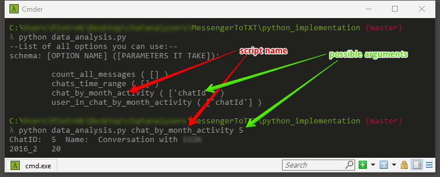
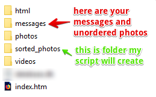
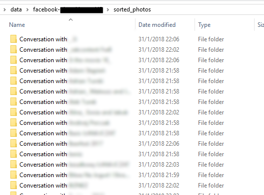

You need `Python 3.*` to run it.

### How to use
Each `*.py` file in this folder is standalone application.

1. Run `data_to_database.py` and follow instructions shown on screen. Provide proper path to folder with `*.html` files containing messages.
2. Script will load data and save it to `[app_folder]/appData/doNotSync/database.db`. The file is SQLite database. You can browse data inside it and run SQL queries using any database manager such [SQLite studio](https://sqlitestudio.pl/index.rvt)
3. Having `database.db` stored in `[app_folder]/appData/doNotSync/database.db`, you can analyse its content using ` 	data_analysis.py` script. After you run it, you will see list of available funcions as well as arguments it needs. After running one of functions, it will return data in console window. It will also generate `*.csv` file (in `[app_folder]/appData/doNotSync`) which can be opened in Excel.

#### Using `data_analysis.py`

```
python .\data_analysis.py [some_function_name] [some_additional_argument]
```

Where `python` means you want to run python script, `.\data_analysis.py` is path to script. In place of `[some_function_name]` type one of functions from list. Optionally , if function takes any parameters, type something in place of `[some_additional_argument]`. 



#### Using `fix_meta_of_media_files.py`

##### What it's for:
Pictures in Messanger Data Copy are unordered and have not datetime assigned. This script will do this for you.

This his how folder with facebook data looks like. When script ask for path, give it path to folder that contains those folder inside:



This is how newly created `sorted_photos` folder will look like:



One messenger conversation -> one folder

Each folder -> all photos from one conversation

Each photo will have date and time of creation in its name.