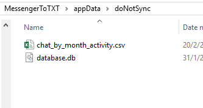

You need `Python 3.*` to run it. Before you do anything, read `How to use`.

### How to use
Each `*.py` file in this folder is standalone application.

1. Run `data_to_database.py` and follow instructions shown on screen. Provide proper path to folder with `*.html` files containing messages.
2. Script will load data and save it to `[app_folder]/appData/doNotSync/database.db`. The file is SQLite database. You can browse data inside it and run SQL queries using any database manager such [SQLite studio](https://sqlitestudio.pl/index.rvt)
3. Having `database.db` stored in `[app_folder]/appData/doNotSync/database.db`, you can analyse its content using ` 	data_analysis.py` script. After you run it, you will see list of available funcions as well as arguments it needs. After running one of functions, it will return data in console window. It will also generate `*.csv` file (in `[app_folder]/appData/doNotSync`) which can be opened in Excel.

---

### Using `data_analysis.py`

Open console and navigate to `python_implementation` folder.

Type:
```
python .\data_analysis.py
```
To view all possible functions you can use.

Type:
```
python .\data_analysis.py [some_function_name] [some_additional_argument]
```

To use some of those functions. In place of `[some_function_name]` type one of functions from list. Optionally , if function takes any parameters, type something in place of `[some_additional_argument]`. 

Here is an example (places where I typed commands are marked with `lambda`):


All functions will also generate `*.csv` files that can be opened in Excel.



### Using `fix_meta_of_media_files.py`

##### What it's for:
Pictures in Messanger Data Copy are unordered and have not datetime assigned. This script is meant to fix it. It will create separate folder for each Messenger conversation and paste there appropriate photos. Photos will have datetime of creation in their name.

This his how folder with facebook data looks like. When script ask for path, give it path to folder that contains those folders inside:


This is how newly created `sorted_photos` folder will look like:

